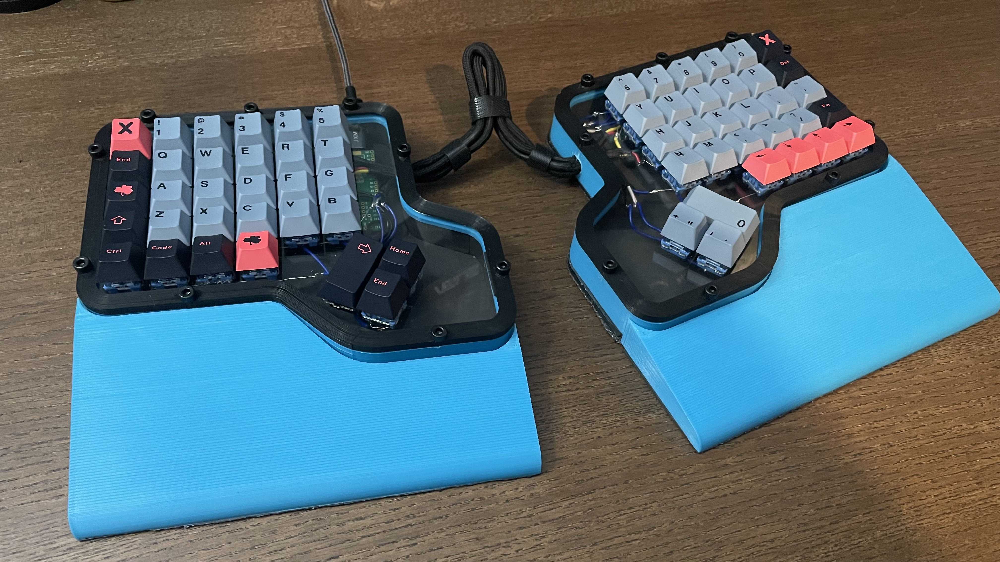
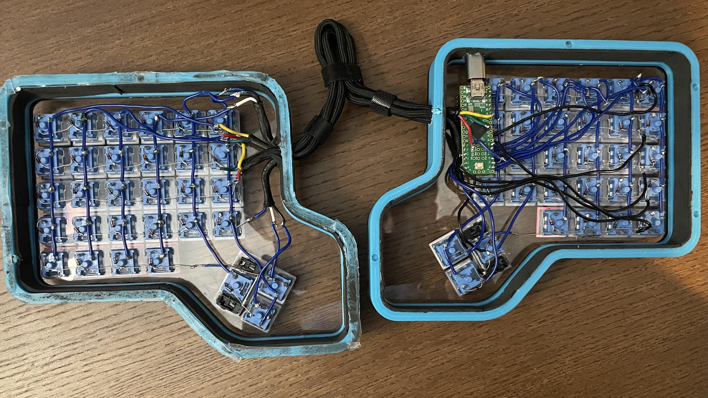
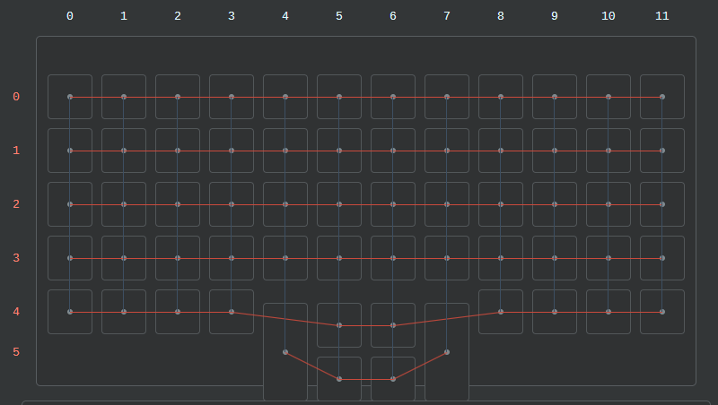

# Split-Ortho-Keyboard

## Parts

Switches: [62x Akko Ocean CS](https://www.amazon.com/dp/B08XXD3MZ1?psc=1&ref=ppx_yo2_dt_b_product_details) Lubed with 205G0

Caps: [GMK 8008](https://www.amazon.com/dp/B096S6TPGD?psc=1&ref=ppx_yo2_dt_b_product_details)

Case: 3D Printed from files designed by me

Plate: PETG Plate, cut from P3DStore.com (can be 3d printed, decided not to for better quality)

Controller: [Teensy++2.0](https://www.amazon.com/dp/B00NC4302Q?psc=1&ref=ppx_yo2_dt_b_product_details) with an [adapter](https://www.amazon.com/dp/B07TLBTXXJ?psc=1&ref=ppx_yo2_dt_b_product_details).

*Note: You can also just use a regular Teensy 2.0 but they were out of stock at the time

Screws: 18x M4 10mm (a bunch of screws because I had them lying around) and 10x M4 8mm

## Handwiring

Not much to say here besides wire according to the matrix, and check your continuity after wiring each row/column together at each switch to save yourself the hassle later (something I realized to do halfway in). My solder joints weren't always the cleanest since I don't do it incredibly often, but by the end I got the hang of it. Should be the same for anyone else doing it if they have minimal experience soldering beforehand. The final result should look something like mine.

I'd recommend soldering the diodes to the switches before putting them in to expedite the process and save yourself some time, since you'll want to save as much time as you can. The handwiring part, while not the most difficult in terms of actions or brainpower, took approximately 8 hours in total. I'd suggest keeping yourself occupied with something in the background to distract yourself from getting mentally exhausted.

If you'd like any help doing this, I'd recommend checking out the [QMK Handwiring Guide](https://beta.docs.qmk.fm/using-qmk/guides/keyboard-building/hand_wire).

## How to Flash

In order to flash the hex provided (or make your own changes for it) press the white button on the teensy, or if the board is already assembled and my hex is deployed, press fn + del.

After that, either launch the teensy software found on their website [here](https://www.pjrc.com/teensy/loader.html) or qmk toolbox. From there, just edit it as you please.

See the [build environment setup](https://docs.qmk.fm/#/getting_started_build_tools) and the [make instructions](https://docs.qmk.fm/#/getting_started_make_guide) for more information. Brand new to QMK? Start with their [Complete Newbs Guide](https://docs.qmk.fm/#/newbs).

## Assembly

For final assembly, gather the M4 screws and put it all together. I put in the M4 screws for the top housing which holds the plate in place, but I opted to attach the bottom piece with double sided tape instead after comparing the sound and whatnot. I'd suggest only doing the tape however if you're 100% sure you're not tampering with the wiring anytime soon. I'd recommend going against hot glue since that will more or less permanently seal it shut unless you want to put in ***a lot*** of effort in removing it.

Overall, it was a fun and rewarding project which ended up teaching me a lot about keyboards and electronics in general. Most importantly, it is far better for the health of my hands in the future. The parts should run you only about $70ish, but if you opt to cut it at P3D Store (whose clear PETG plate is great) it'll be more like $100. I spent a bit more for some little parts which I didn't have lying around.
