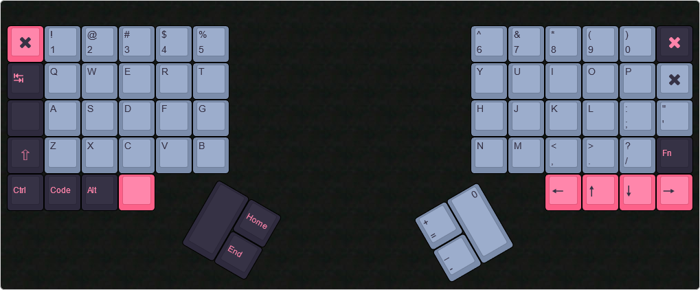

# Split-Ortho-Keyboard

## Parts

Switches: [62x Akko Ocean CS](https://www.amazon.com/dp/B08XXD3MZ1?psc=1&ref=ppx_yo2_dt_b_product_details) Lubed with 205G0

Case: 3D Printed from files

Caps: [GMK 8008](https://www.amazon.com/dp/B096S6TPGD?psc=1&ref=ppx_yo2_dt_b_product_details)

Plate: PETG Plate, cut from P3DStore.com (can be 3d printed, decided not to for better quality)

Foam: [Roll of Neoprene](https://www.amazon.com/dp/B07PHW6QS9?psc=1&ref=ppx_yo2_dt_b_product_details)

Controller: [Teensy++2.0](https://www.amazon.com/dp/B00NC4302Q?psc=1&ref=ppx_yo2_dt_b_product_details) with an [adapter](https://www.amazon.com/dp/B07TLBTXXJ?psc=1&ref=ppx_yo2_dt_b_product_details)

Screws: 18x M4 10mm (a bunch of screws because I had them lying around) and 10x M4 8mm

